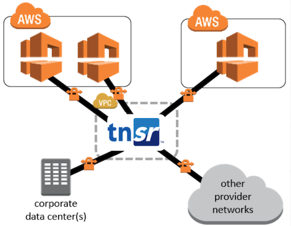

# TNSR-Transit VPC Project
## Introduction
Netgate's TNSR is a high-speed packet processing engine. It enables secure networking at speeds up to 100+ Gbps - at a fraction of the price of proprietary alternatives. You can learn more about TNSR here: https://www.netgate.com/products/tnsr/

AWS Transit VPC enables multiple Virtual Private Clouds (VPCs) - either geographically disparate and/or running in separate AWS accounts - to connect to a common VPC that serves as a global network transit center. Transit VPC simplifies cloud network management and minimizes the number of connections that must be configured and managed. Further, owing to its virtual implementation, no physical network equipment - or physical presence in a colocation transit hub is required.

## Advantages
In this project a TNSR instance is used to connect multiple AWS VPCS via high speed IPSec tunnels. The advantages of this approach are many:

* Provides a way to interconnect VPCs in different regions with each other and with remote networks.
* Provides security using IPsec with strong encryption. 
* The IPsec cryptographic implementation is optimized for performance, which allows for high throughput.
* Support for IKEv2. AWS only supports IKEv1 on their VPN connections, but TNSR supports both IKEv1 and IKEv2, so connections to remote datacenters or cloud provider networks can use IKEv2.
* Very cost effective when compared with comparable options (AWS Direct Connect, other Transit VPC images - see pricing at the bottom of https://docs.aws.amazon.com/solutions/latest/cisco-based-transit-vpc/overview.html).

## Provisioning
TNSR is provisioned with 2 interfaces. The first interface is attached to the instance's kernel networking stack and is used to manage the instance via SSH or RESTCONF. The second interface is managed by the VPP packet processing daemon and is used to terminate IPsec tunnels which will be used to pass traffic securely between the VPCs and remote networks that will participate in the Transit VPC. The interfaces should each have an Elastic IP address assigned.

For deployment TransitVPC uses the CloudFormation template which contains basic parameters for running the TNSR instance. The CloudFormation template also creates roles, policies, and LambdaFunctions in AWS as well as setting up a schedule for the Lambda script.

## Documentation
Please consult the documents in the Docs folder for complete details of the Transit VPS solution.